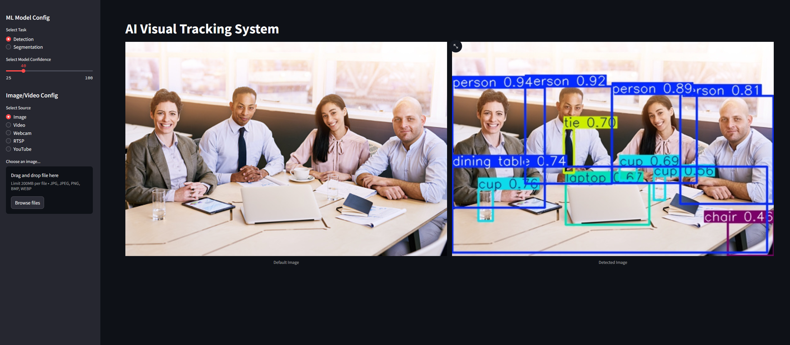
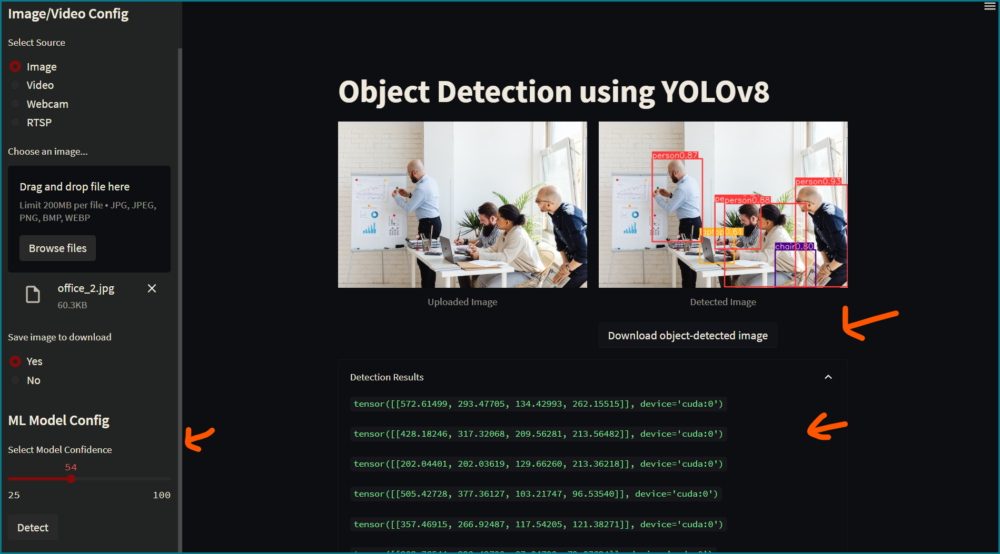
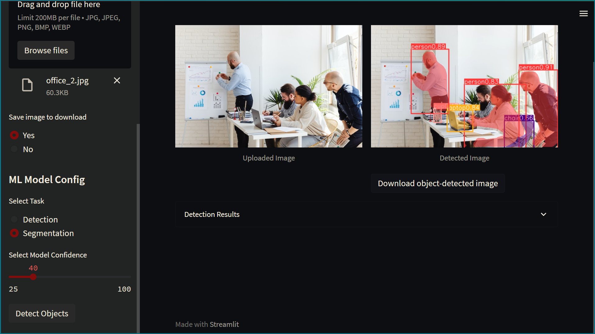

# <span style="color:deepskyblue"> Real-time Object Detection and Tracking with Streamlit </span>

This repository combined object detection and tracking using YOLOv8 for detection and Streamlit for building the web interface. It provides a customizable and easy-to-use tool for detecting and tracking objects in real-time video streams, and YouTube feeds, as well as pre-recorded videos and images.

## <span style="color:deepskyblue"> Tracking With Object Detection Demo</span>

<https://user-images.githubusercontent.com/104087274/234874398-75248e8c-6965-4c91-9176-622509f0ad86.mov>

## Demo Pics

### Home page



### Page after uploading an image and object detection



### Segmentation task on image



## Requirements

Python 3.11
YOLOv8
Streamlit

```bash
pip install ultralytics streamlit pytube
```

## Installation

- Clone the repository: git clone <https://github.com/Arshiakhan50/AI-Visual-Tracking.git>
- Change to the repository directory: `cd yolov8-streamlit-detection-tracking`
- Create `weights`, `videos`, and `images` directories inside the project.
- Download the pre-trained YOLOv8 weights from (<https://github.com/ultralytics/assets/releases/download/v0.0.0/yolov8n.pt>) and save them to the `weights` directory in the same project.

## Usage

- Run the app with the following command: `streamlit run app.py`
- The app should open in a new browser window.

### ML Model Config

- Select task (Detection, Segmentation)
- Select model confidence
- Use the slider to adjust the confidence threshold (25-100) for the model.

One the model config is done, select a source.

### Detection on images

- The default image with its objects-detected image is displayed on the main page.
- Select a source. (radio button selection `Image`).
- Upload an image by clicking on the "Browse files" button.
- Click the "Detect Objects" button to run the object detection algorithm on the uploaded image with the selected confidence threshold.

### Detection on RTSP

- Select the RTSP stream button
- Enter the rtsp url inside the textbox and hit `Detect Objects` button

### Detection on YouTube Video URL

- Select the source as YouTube
- Copy paste the url inside the text box.
- The detection/segmentation task will start on the YouTube video url

### Hit star ⭐ if you like this repo!!!
